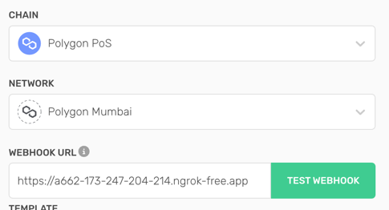

## About
a light client for an NFT marketplace that allows users to list their NFT in a Marketplace. 


## Getting Started
This is a [Next.js](https://nextjs.org/) project bootstrapped with [`create-next-app`](https://github.com/vercel/next.js/tree/canary/packages/create-next-app).


####Step 1
```bash
yarn dev
```
Open [http://localhost:3000](http://localhost:3000) with your browser to see the result.
___
####Step 2 Get [Ngrok](https://ngrok.com/)
For receiving smart contract webhooks from Alchemy's Notify

Copy the output of the following, should look similar to`https://a662-173-247-204-214.ngrok-free.app`
```bash
ngrok http 3000
```
___
####Step 3 set up webhook at [Alchemy's Notify](https://dashboard.alchemy.com/notify)
Click the following:

a. Create a GraphQL webhook 
b. Select Polygon and Mumbai and paste the link from step 2 !
c.  Select a Blank template, and paste the query from `src/utils/webhook.sql`
the current smart contract address is `0xa93f979dceD76ca07e0D9b7d83EDC24F60F04398`,  could be swapped inside the sql 
file, as well as in the `contracts/GuiseMarketplace.sol`

d. click  

---

####Step 3: 
Obtain Supabase credentials from the author

---

##Design decisions: 
user flow: 
user goes to `/list` page and input NFT details, and then click list. A request is made to the smart contract, and an 
ItemListed event is emitted. The event is then picked up by Alchemy's Notify, and a webhook is sent to the 
NFT-Marketplace's `/alchemy-hooks` endpoint. The server then persists the event data to the database. The user is 
then redirected to the /list page. When visit the `/marketplace` place, all NFT listings would be reflected.

* Next.js - out of box api implementation, and overall very easy to maintain
* Tailwind CSS --> highly customizable, not as regimented as some UI libaries,  it may require more upfront configuration and setup than other CSS frameworks, but it provides a more robust and customizable styling solution.
* Wagmi --> its web3 webhooks currently offer more advanced features and functionality, a close contender 
  is Uniswap/web3-react, which lacks good documentation.  
* RainbowKit --> easy of use
* Alchemy's Notify --> the most customized approach to listen to events would invovle using a sub/pub or sns/sqs system. However, that would require more time to implement. Even though Notify is 
  fairly new, it is still a very good tool to use to get notified for events without having to poll. And Websocket 
  would not apply here since the app doesn't have a lot of real time use cases yet. One trade-off of using this tool is that it may require additional setup and configuration to ensure reliable event handling
  design than calling the 
* Supabase --> Since NFT transactions and NFT details could only be retrieved from events, it is necessary to 
  persist all event data. In this case, a sql database is chosen, because the data is more structured and it invovles 
  transactions. 
* React
* Next.js

Others: 
- it was very difficult to find an approach to retrieve NFT's image source(metadata) details, especially for a 
  testnet(Mumbai). Hence a hard coded NFT image was put in place. Another choice was made to focus more on the UI/UX 
  and making the system more scalable for the long-term(using Webhooks etc.) rather than completing more features. 


improvement:
* Improved user experience: Continuously improve the user experience by adding more intuitive interfaces, reducing loading times, and improving error handling.
* Advanced search and filtering: Implement advanced search and filtering functionality to help users easily find NFTs they're interested in, based on criteria such as price, category, or artist.
* System optimization: Caching events right when they are received, or have db fire off events to front end when 
  there' a new DB operations 
* Investigate whether the smart contact can be optimized, requesting user to grant permission of the entire 
  collection to the marketplace could be disruptive 
* Robust tests
* More tables, a table for users, sellers etc, track more information about our users for metrics 
  

cache
more features, and interactions with users
- if  not sigh in 

###Project's Stack:


You can start editing the page by modifying `pages/index.js`. The page auto-updates as you edit the file.

[API routes](https://nextjs.org/docs/api-routes/introduction) can be accessed on [http://localhost:3000/api/hello](http://localhost:3000/api/hello). This endpoint can be edited in `pages/api/hello.ts`.

The `pages/api` directory is mapped to `/api/*`. Files in this directory are treated as [API routes](https://nextjs.org/docs/api-routes/introduction) instead of React pages.

This project uses [`next/font`](https://nextjs.org/docs/basic-features/font-optimization) to automatically optimize and load Inter, a custom Google Font.
